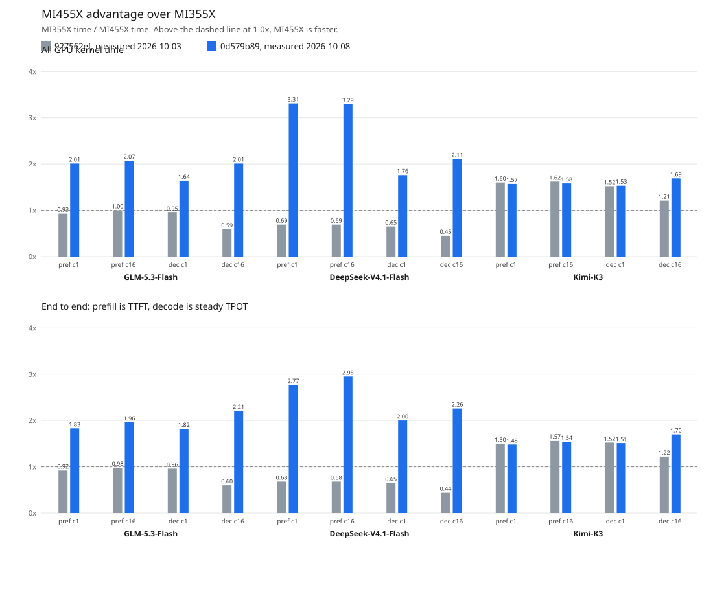

# Emulated rank 0 with speculative decoding: MI355X vs MI455X at `d4a92893`

One GPU per architecture serves global rank 0 of each model's CI layout
with `tokenspeed serve --emulate-rank-zero`, dummy weights, uniform MoE
routing and a fixed simulated accept length. Collectives are local
substitutes, so the numbers are a compute estimate, not serving
performance. Both architectures ran the same tree and workload.

The tree is emulation base `d4a92893` plus the changes in `0d579b89`.
GLM-5.3-Flash on MI455X is copied from the earlier run of that same tree.



The bars are MI355X time divided by MI455X time. Above 1.0x, MI455X is
faster. Gray is the 2026-10-03 comparison at `927562ef`. Blue is this run.
The top row is total GPU kernel time. The bottom row is end to end:
time to first token for prefill, steady decode time per output token
for decode.

## Provenance

| Field | Value |
|---|---|
| TokenSpeed revision | `d4a928936a9425cbbaba7a02a745aaf90c299e16` |
| Commit date (UTC) | 2026-10-08 |
| Changes on top | 64 files, identical on both hosts |
| Measured | 2026-10-08 |
| Prompt / output tokens | 50,000 / 500 |
| Concurrencies | 1, 16 |
| Warmup / measured waves | 1 / 1 |
| MI355X | `gfx950:sramecc+:xnack-`, 2.14.0+rocm7.2, `zhewenyu/emulate-rank0:9b707d56-gfx950` |
| MI455X | `gfx1250`, 2.14.0+rocm10.2.0a20260923, `tokenspeed-gfx1250:9b707d56-torch214` |
| tokenspeed-triton | 3.8.10.post20260920 / 3.8.10.post20260920 |

## Simulated acceptance

Logged values are medians over the server's 40-step decode windows;
windows that straddle a prefill keep fewer tokens. See
`emulate_rank0/README.md` for where each simulated value comes from.

| Model | Layout emulated | Simulated | MI355X logged | MI455X logged |
|---|---|---:|---|---|
| GLM-5.3-Flash MTP | TP4 | 2.9 | 2.90 (18 windows) | 2.90 (18 windows) |
| DeepSeek-V4.1-Flash DSPARK | TP4 | 3.9 | 3.90 (13 windows) | 3.90 (13 windows) |
| Kimi-K3 EAGLE3 | TP8 | 3.75 | 3.75 (14 windows) | 3.75 (14 windows) |

Latency rows are lower-is-better and throughput rows higher-is-better;
the last column is always MI455X's advantage. TPOT p50 is per request
over its whole decode, as CI reports it. At batch 16 every request
arrives at once, so a request whose prompt finishes early decodes
between other requests' prefill chunks, and its TPOT mostly measures
prefill. Steady decode TPOT is the median over the server's 40-step
decode windows in which every request was decoding and no prefill ran;
decode tok/s per user and the decode columns below use it. Both include
the speculative speedup.

## GLM-5.3-Flash MTP

| Metric | Batch | MI355X (gfx950) | MI455X (gfx1250) | MI455X advantage |
|---|---:|---:|---:|---:|
| TTFT p50 (ms) | 1 | 2,330.5 | 1,276.8 | 1.83x |
| TPOT p50 (ms) | 1 | 4.9 | 2.7 | 1.81x |
| steady decode TPOT (ms) | 1 | 4.8 | 2.6 | 1.82x |
| decode tok/s per user | 1 | 207.8 | 378.7 | 1.82x |
| aggregate output tok/s | 1 | 105.0 | 191.1 | 1.82x |
| TTFT p50 (ms) | 16 | 19,135.4 | 9,781.0 | 1.96x |
| TPOT p50 (ms) | 16 | 43.9 | 21.9 | 2.00x |
| steady decode TPOT (ms) | 16 | 9.7 | 4.4 | 2.21x |
| decode tok/s per user | 16 | 102.8 | 227.5 | 2.21x |
| aggregate output tok/s | 16 | 194.9 | 385.6 | 1.98x |

Accumulated GPU kernel time per bucket, MI355X over MI455X, so
above 1.00x means MI455X is ahead. The last row compares the
measured TTFT p50 and steady decode TPOT from the table above; it
is not a total of the rows.

| Category | prefill c1 | prefill c16 | decode c1 | decode c16 |
|---|---:|---:|---:|---:|
| KDA state scan | 1.32x | 1.32x | — | — |
| KDA other | 1.66x | 1.63x | 1.17x | 1.53x |
| MoE | 13.94x | 13.38x | 5.53x | 30.06x |
| sparse attention | 2.25x | 2.59x | 2.62x | 1.72x |
| dense GEMM | 2.38x | 2.39x | 2.27x | 1.94x |
| attention | 1.27x | 1.29x | 1.08x | 1.19x |
| hyper-connections | 2.42x | 2.38x | 1.14x | 1.01x |
| quantize | 1.54x | 1.49x | 1.21x | 1.50x |
| rmsnorm | 1.70x | 1.73x | 1.02x | 1.06x |
| top-k and sort | 1.32x | 1.29x | — | — |
| sampling | 1.21x | 1.26x | 1.31x | 1.79x |
| elementwise | 0.67x | 0.65x | 0.76x | 0.89x |
| other | 0.19x | 0.18x | 0.12x | 0.19x |
| all kernels | 2.01x | 2.07x | 1.64x | 2.01x |
| **End-to-end** | **1.83x** (TTFT) | **1.96x** (TTFT) | **1.82x** (steady TPOT) | **2.21x** (steady TPOT) |

<details><summary>MI355X (gfx950) prefill c1: heaviest 10 kernels</summary>

| Rank | Category | Kernel | GPU time (ms) | Calls | Mean/call (us) | Share |
|---:|---|---|---:|---:|---:|---:|
| 1 | dense GEMM | `_w8a8_block_fp8_matmul` | 330.412 | 906 | 364.7 | 14.86% |
| 2 | MoE | `gluon_bf16_moe_stage1_kernel` | 323.439 | 294 | 1,100.1 | 14.55% |
| 3 | sparse attention | `_dsa_dense_mfma_kv_kernel` | 312.972 | 86 | 3,639.2 | 14.08% |
| 4 | sparse attention | `_hadamard_128_kernel` | 185.118 | 86 | 2,152.5 | 8.33% |
| 5 | hyper-connections | `_mhc_prefill_project_hc4_kernel` | 159.595 | 630 | 253.3 | 7.18% |
| 6 | MoE | `gluon_bf16_moe_stage2_kernel` | 137.661 | 294 | 468.2 | 6.19% |
| 7 | sparse attention | `gluon_kpool_prefill_topk_fp8_plan_gfx950` | 105.840 | 120 | 882.0 | 4.76% |
| 8 | dense GEMM | `Cijk_Alik_Bljk_BBS_BH_Bias_HA_S_SAV_UserArgs_MT208x256x64_MI16x16x1_SN_LDSB1_AFC0_AFEM1_AFEM1_ASEM1_CLR1_CADS0_DTLA0_...` | 70.157 | 204 | 343.9 | 3.16% |
| 9 | hyper-connections | `_mhc_post_hc4_triton_kernel` | 67.667 | 630 | 107.4 | 3.04% |
| 10 | KDA state scan | `gluon_kda_paged_prefill_state_scan_gfx950` | 63.720 | 272 | 234.3 | 2.87% |

</details>

<details><summary>MI355X (gfx950) prefill c16: heaviest 10 kernels</summary>

| Rank | Category | Kernel | GPU time (ms) | Calls | Mean/call (us) | Share |
|---:|---|---|---:|---:|---:|---:|
| 1 | dense GEMM | `_w8a8_block_fp8_matmul` | 5,267.320 | 12,704 | 414.6 | 15.01% |
| 2 | sparse attention | `_dsa_dense_mfma_kv_kernel` | 4,992.008 | 1,208 | 4,132.5 | 14.23% |
| 3 | MoE | `gluon_bf16_moe_stage1_kernel` | 4,965.333 | 4,116 | 1,206.3 | 14.15% |
| 4 | sparse attention | `_hadamard_128_kernel` | 2,956.305 | 1,208 | 2,447.3 | 8.43% |
| 5 | hyper-connections | `_mhc_prefill_project_hc4_kernel` | 2,512.993 | 8,820 | 284.9 | 7.16% |
| 6 | MoE | `gluon_bf16_moe_stage2_kernel` | 2,137.078 | 4,116 | 519.2 | 6.09% |
| 7 | sparse attention | `gluon_kpool_prefill_topk_fp8_plan_gfx950` | 1,662.235 | 1,764 | 942.3 | 4.74% |
| 8 | dense GEMM | `Cijk_Alik_Bljk_BBS_BH_Bias_HA_S_SAV_UserArgs_MT208x256x64_MI16x16x1_SN_LDSB1_AFC0_AFEM1_AFEM1_ASEM1_CLR1_CADS0_DTLA0_...` | 1,141.565 | 3,332 | 342.6 | 3.25% |
| 9 | hyper-connections | `_mhc_post_hc4_triton_kernel` | 1,083.671 | 8,820 | 122.9 | 3.09% |
| 10 | sparse attention | `_dsa_oneblock_manual_radix_topk_kernel` | 1,006.542 | 2,372 | 424.3 | 2.87% |

</details>

<details><summary>MI355X (gfx950) decode c1: heaviest 10 kernels</summary>

| Rank | Category | Kernel | GPU time (ms) | Calls | Mean/call (us) | Share |
|---:|---|---|---:|---:|---:|---:|
| 1 | dense GEMM | `_w8a8_block_fp8_matmul` | 160.089 | 8,832 | 18.1 | 16.39% |
| 2 | sparse attention | `_dsa_dense_mfma_kv_kernel` | 117.783 | 896 | 131.5 | 12.06% |
| 3 | MoE | `_stage1_fp8_warp_gemv` | 84.582 | 2,880 | 29.4 | 8.66% |
| 4 | MoE | `_stage2_fp8_warp_gemv` | 58.435 | 2,880 | 20.3 | 5.98% |
| 5 | hyper-connections | `gluon_mhc_pre_gfx950` | 57.344 | 5,760 | 10.0 | 5.87% |
| 6 | hyper-connections | `_mhc_prenorm_gemm_triton_kernel` | 56.312 | 5,760 | 9.8 | 5.77% |
| 7 | dense GEMM | `Cijk_Alik_Bljk_BBS_BH_Bias_HA_S_SAV_UserArgs_MT256x16x64_MI16x16x1_SN_LDSB1_AFC0_AFEM1_AFEM1_ASEM1_CLR1_CADS0_DTLA0_D...` | 32.415 | 2,368 | 13.7 | 3.32% |
| 8 | sparse attention | `_dsa_oneblock_manual_radix_topk_kernel` | 29.638 | 896 | 33.1 | 3.03% |
| 9 | quantize | `_per_token_group_quant_8bit` | 26.213 | 8,832 | 3.0 | 2.68% |
| 10 | KDA other | `fused_recurrent_kda_mtp_fwd_kernel` | 23.475 | 2,176 | 10.8 | 2.40% |

</details>

<details><summary>MI355X (gfx950) decode c16: heaviest 10 kernels</summary>

| Rank | Category | Kernel | GPU time (ms) | Calls | Mean/call (us) | Share |
|---:|---|---|---:|---:|---:|---:|
| 1 | MoE | `gluon_bf16_moe_stage1_kernel` | 610.972 | 2,688 | 227.3 | 33.00% |
| 2 | MoE | `gluon_bf16_moe_stage2_kernel` | 250.054 | 2,688 | 93.0 | 13.51% |
| 3 | dense GEMM | `_w8a8_block_fp8_matmul` | 157.282 | 8,832 | 17.8 | 8.49% |
| 4 | sparse attention | `_kpool_score_dense_mma_kernel` | 77.784 | 896 | 86.8 | 4.20% |
| 5 | hyper-connections | `gluon_mhc_pre_gfx950` | 60.161 | 5,760 | 10.4 | 3.25% |
| 6 | KDA other | `fused_recurrent_kda_mtp_fwd_kernel` | 49.425 | 2,176 | 22.7 | 2.67% |
| 7 | hyper-connections | `_mhc_prenorm_gemm_triton_kernel` | 46.319 | 5,760 | 8.0 | 2.50% |
| 8 | dense GEMM | `Cijk_Alik_Bljk_BBS_BH_Bias_HA_S_SAV_UserArgs_MT64x32x256_MI16x16x1_SN_LDSB0_AFC0_AFEM1_AFEM1_ASEM1_CLR0_CADS0_DTLA1_D...` | 46.156 | 2,176 | 21.2 | 2.49% |
| 9 | dense GEMM | `Cijk_Alik_Bljk_BBS_BH_Bias_HA_S_SAV_UserArgs_MT16x16x1024_MI16x16x1_SN_LDSB1_AFC0_AFEM1_AFEM1_ASEM1_CLR1_CADS0_DTLA0_...` | 43.688 | 5,120 | 8.5 | 2.36% |
| 10 | sparse attention | `_dsa_dense_mfma_kv_kernel` | 38.591 | 896 | 43.1 | 2.08% |

</details>

<details><summary>MI455X (gfx1250) prefill c1: heaviest 10 kernels</summary>

| Rank | Category | Kernel | GPU time (ms) | Calls | Mean/call (us) | Share |
|---:|---|---|---:|---:|---:|---:|
| 1 | sparse attention | `gluon_kpool_prefill_topk_fp8_plan_gfx1250` | 140.117 | 120 | 1,167.6 | 12.69% |
| 2 | other | `_fp8_block_down_gfx1250` | 112.035 | 303 | 369.8 | 10.15% |
| 3 | other | `_fp8_block_gate_up_gfx1250` | 97.984 | 303 | 323.4 | 8.88% |
| 4 | sparse attention | `_dsa_wave32_radix_topk_kernel` | 86.523 | 146 | 592.6 | 7.84% |
| 5 | dense GEMM | `_w8a8_block_fp8_matmul` | 85.618 | 875 | 97.8 | 7.76% |
| 6 | sparse attention | `_dsa_selected_dense_wmma_kernel` | 62.813 | 86 | 730.4 | 5.69% |
| 7 | hyper-connections | `_mhc_prefill_project_hc4_kernel` | 60.310 | 630 | 95.7 | 5.46% |
| 8 | elementwise | `void at::native::elementwise_kernel_manual_unroll<128, 8, at::native::gpu_kernel_impl_nocast<at::native::(anonymous n...` | 54.941 | 303 | 181.3 | 4.98% |
| 9 | dense GEMM | `Cijk_Alik_Bljk_BBS_BH_Bias_HA_S_SAV_UserArgs_MT208x256x128_MI16x16x1_SN_LDSB0_AFC1_AG0_AGGSUA0_AGNTAB0_AFEM1_AFEM1_AS...` | 51.652 | 204 | 253.2 | 4.68% |
| 10 | KDA state scan | `gluon_kda_paged_prefill_state_scan_gfx1250` | 48.105 | 272 | 176.9 | 4.36% |

</details>

<details><summary>MI455X (gfx1250) prefill c16: heaviest 10 kernels</summary>

| Rank | Category | Kernel | GPU time (ms) | Calls | Mean/call (us) | Share |
|---:|---|---|---:|---:|---:|---:|
| 1 | other | `_fp8_block_down_gfx1250` | 1,829.370 | 4,246 | 430.8 | 10.77% |
| 2 | other | `_fp8_block_gate_up_gfx1250` | 1,562.579 | 4,246 | 368.0 | 9.20% |
| 3 | sparse attention | `gluon_kpool_prefill_topk_fp8_plan_gfx1250` | 1,523.563 | 1,764 | 863.7 | 8.97% |
| 4 | sparse attention | `_dsa_wave32_radix_topk_kernel` | 1,452.739 | 2,372 | 612.5 | 8.55% |
| 5 | dense GEMM | `_w8a8_block_fp8_matmul` | 1,376.007 | 12,250 | 112.3 | 8.10% |
| 6 | sparse attention | `_dsa_selected_dense_wmma_kernel` | 1,028.486 | 1,208 | 851.4 | 6.05% |
| 7 | hyper-connections | `_mhc_prefill_project_hc4_kernel` | 970.689 | 8,820 | 110.1 | 5.71% |
| 8 | elementwise | `void at::native::elementwise_kernel_manual_unroll<128, 8, at::native::gpu_kernel_impl_nocast<at::native::(anonymous n...` | 879.583 | 4,246 | 207.2 | 5.18% |
| 9 | dense GEMM | `Cijk_Alik_Bljk_BBS_BH_Bias_HA_S_SAV_UserArgs_MT208x256x128_MI16x16x1_SN_LDSB0_AFC1_AG0_AGGSUA0_AGNTAB0_AFEM1_AFEM1_AS...` | 852.908 | 3,332 | 256.0 | 5.02% |
| 10 | KDA state scan | `gluon_kda_paged_prefill_state_scan_gfx1250` | 758.346 | 3,876 | 195.7 | 4.46% |

</details>

<details><summary>MI455X (gfx1250) decode c1: heaviest 10 kernels</summary>

| Rank | Category | Kernel | GPU time (ms) | Calls | Mean/call (us) | Share |
|---:|---|---|---:|---:|---:|---:|
| 1 | hyper-connections | `_mhc_pre_mix_hc4_kernel` | 43.594 | 5,760 | 7.6 | 7.33% |
| 2 | dense GEMM | `_wmma_tdm_dense_kernel` | 42.579 | 9,408 | 4.5 | 7.16% |
| 3 | hyper-connections | `_mhc_prenorm_gemm_triton_kernel` | 40.232 | 5,760 | 7.0 | 6.76% |
| 4 | sparse attention | `_dsa_wave32_radix_topk_kernel` | 38.277 | 896 | 42.7 | 6.43% |
| 5 | other | `_fp8_block_gate_up_gfx1250` | 35.341 | 2,880 | 12.3 | 5.94% |
| 6 | dense GEMM | `Cijk_Alik_Bljk_BBS_BH_Bias_HA_S_SAV_UserArgs_MT64x16x64_MI16x16x1_SN_LDSB0_AFC1_AG0_AGGSUA0_AGNTAB0_AFEM1_AFEM1_ASEM1...` | 33.566 | 5,376 | 6.2 | 5.64% |
| 7 | dense GEMM | `gluon_mm_fp8_blockscale_gfx1250_bn16_bk2048_buf3_sk1_tdmf0` | 26.367 | 4,864 | 5.4 | 4.43% |
| 8 | other | `_fp8_block_down_gfx1250` | 21.854 | 2,880 | 7.6 | 3.67% |
| 9 | quantize | `_per_token_group_quant_8bit` | 21.577 | 8,832 | 2.4 | 3.63% |
| 10 | rmsnorm | `_rmsnorm_kernel` | 21.489 | 6,784 | 3.2 | 3.61% |

</details>

<details><summary>MI455X (gfx1250) decode c16: heaviest 10 kernels</summary>

| Rank | Category | Kernel | GPU time (ms) | Calls | Mean/call (us) | Share |
|---:|---|---|---:|---:|---:|---:|
| 1 | other | `_fp8_block_gate_up_gfx1250` | 173.276 | 2,880 | 60.2 | 18.80% |
| 2 | other | `_fp8_block_down_gfx1250` | 102.317 | 2,880 | 35.5 | 11.10% |
| 3 | dense GEMM | `_wmma_tdm_dense_kernel` | 66.852 | 10,112 | 6.6 | 7.25% |
| 4 | hyper-connections | `_mhc_pre_mix_hc4_kernel` | 64.821 | 5,760 | 11.3 | 7.03% |
| 5 | sparse attention | `_dsa_wave32_radix_topk_kernel` | 40.646 | 896 | 45.4 | 4.41% |
| 6 | dense GEMM | `Cijk_Alik_Bljk_BBS_BH_Bias_HA_S_SAV_UserArgs_MT32x32x64_MI16x16x1_SN_LDSB0_AFC1_AG0_AGGSUA0_AGNTAB0_AFEM1_AFEM1_ASEM1...` | 32.909 | 5,120 | 6.4 | 3.57% |
| 7 | hyper-connections | `_mhc_prenorm_gemm_triton_kernel` | 27.865 | 5,760 | 4.8 | 3.02% |
| 8 | KDA other | `fused_recurrent_kda_mtp_fwd_kernel` | 27.246 | 2,176 | 12.5 | 2.96% |
| 9 | sparse attention | `_kpool_score_dense_mma_kernel` | 23.992 | 896 | 26.8 | 2.60% |
| 10 | quantize | `_per_token_group_quant_8bit` | 23.962 | 8,832 | 2.7 | 2.60% |

</details>

## DeepSeek-V4.1-Flash DSPARK

| Metric | Batch | MI355X (gfx950) | MI455X (gfx1250) | MI455X advantage |
|---|---:|---:|---:|---:|
| TTFT p50 (ms) | 1 | 1,578.0 | 570.0 | 2.77x |
| TPOT p50 (ms) | 1 | 6.8 | 3.4 | 2.00x |
| steady decode TPOT (ms) | 1 | 6.7 | 3.3 | 2.00x |
| decode tok/s per user | 1 | 149.9 | 300.4 | 2.00x |
| aggregate output tok/s | 1 | 100.9 | 221.1 | 2.19x |
| TTFT p50 (ms) | 16 | 13,124.1 | 4,453.4 | 2.95x |
| TPOT p50 (ms) | 16 | 37.6 | 14.5 | 2.59x |
| steady decode TPOT (ms) | 16 | 14.1 | 6.3 | 2.26x |
| decode tok/s per user | 16 | 70.7 | 159.6 | 2.26x |
| aggregate output tok/s | 16 | 250.6 | 682.2 | 2.72x |

Accumulated GPU kernel time per bucket, MI355X over MI455X, so
above 1.00x means MI455X is ahead. The last row compares the
measured TTFT p50 and steady decode TPOT from the table above; it
is not a total of the rows.

| Category | prefill c1 | prefill c16 | decode c1 | decode c16 |
|---|---:|---:|---:|---:|
| MoE | 2.70x | 2.70x | 2.11x | 2.78x |
| sparse attention | 2.83x | 2.79x | 1.57x | 1.91x |
| dense GEMM | 4.59x | 4.55x | 2.52x | 2.11x |
| hyper-connections | 4.50x | 4.56x | 1.36x | 1.30x |
| quantize | — | — | — | — |
| rmsnorm | 1.40x | 1.42x | 1.25x | 1.18x |
| top-k and sort | 9.57x | 9.52x | 1.46x | 1.41x |
| sampling | 1.22x | 1.15x | 1.57x | 2.62x |
| elementwise | 1.77x | 1.77x | 1.32x | 2.96x |
| other | 0.74x | 0.76x | 0.32x | 0.37x |
| all kernels | 3.31x | 3.29x | 1.76x | 2.11x |
| **End-to-end** | **2.77x** (TTFT) | **2.95x** (TTFT) | **2.00x** (steady TPOT) | **2.26x** (steady TPOT) |

<details><summary>MI355X (gfx950) prefill c1: heaviest 10 kernels</summary>

| Rank | Category | Kernel | GPU time (ms) | Calls | Mean/call (us) | Share |
|---:|---|---|---:|---:|---:|---:|
| 1 | sparse attention | `gluon_dsv41_index_topk_gfx950` | 282.284 | 593 | 476.0 | 18.01% |
| 2 | dense GEMM | `_w8a8_block_fp8_matmul` | 280.265 | 452 | 620.1 | 17.88% |
| 3 | sparse attention | `gluon_dsv4_prefill_gfx950` | 214.152 | 160 | 1,338.4 | 13.66% |
| 4 | MoE | `_pipelined_moe_kernel_scaled_block_schedule` | 171.700 | 320 | 536.6 | 10.95% |
| 5 | hyper-connections | `_mhc_prenorm_gemm_triton_kernel` | 129.011 | 320 | 403.2 | 8.23% |
| 6 | quantize | `_fp8_group32_ue8m0_quantize` | 101.312 | 842 | 120.3 | 6.46% |
| 7 | dense GEMM | `gluon_mm_mxfp8_gfx950` | 45.577 | 390 | 116.9 | 2.91% |
| 8 | top-k and sort | `void at::native::mbtopk::computeBlockDigitCounts<float, unsigned int, unsigned int, 2>(at::cuda::detail::TensorInfo<f...` | 37.136 | 2,376 | 15.6 | 2.37% |
| 9 | hyper-connections | `_mhc_post_hc4_triton_kernel` | 35.493 | 320 | 110.9 | 2.26% |
| 10 | elementwise | `_rope_inplace_kernel` | 18.240 | 402 | 45.4 | 1.16% |

</details>

<details><summary>MI355X (gfx950) prefill c16: heaviest 10 kernels</summary>

| Rank | Category | Kernel | GPU time (ms) | Calls | Mean/call (us) | Share |
|---:|---|---|---:|---:|---:|---:|
| 1 | sparse attention | `gluon_dsv41_index_topk_gfx950` | 4,508.927 | 9,583 | 470.5 | 18.23% |
| 2 | dense GEMM | `_w8a8_block_fp8_matmul` | 4,283.107 | 5,682 | 753.8 | 17.32% |
| 3 | sparse attention | `gluon_dsv4_prefill_gfx950` | 3,438.836 | 2,920 | 1,177.7 | 13.91% |
| 4 | MoE | `_pipelined_moe_kernel_scaled_block_schedule` | 2,621.013 | 4,560 | 574.8 | 10.60% |
| 5 | hyper-connections | `_mhc_prenorm_gemm_triton_kernel` | 2,065.368 | 4,560 | 452.9 | 8.35% |
| 6 | quantize | `_fp8_group32_ue8m0_quantize` | 1,619.562 | 12,002 | 134.9 | 6.55% |
| 7 | dense GEMM | `gluon_mm_mxfp8_gfx950` | 737.233 | 6,320 | 116.7 | 2.98% |
| 8 | top-k and sort | `void at::native::mbtopk::computeBlockDigitCounts<float, unsigned int, unsigned int, 2>(at::cuda::detail::TensorInfo<f...` | 588.320 | 36,300 | 16.2 | 2.38% |
| 9 | hyper-connections | `_mhc_post_hc4_triton_kernel` | 568.354 | 4,560 | 124.6 | 2.30% |
| 10 | elementwise | `_rope_inplace_kernel` | 289.819 | 5,718 | 50.7 | 1.17% |

</details>

<details><summary>MI355X (gfx950) decode c1: heaviest 10 kernels</summary>

| Rank | Category | Kernel | GPU time (ms) | Calls | Mean/call (us) | Share |
|---:|---|---|---:|---:|---:|---:|
| 1 | dense GEMM | `_w8a8_block_fp8_matmul` | 539.130 | 14,528 | 37.1 | 31.13% |
| 2 | sparse attention | `gluon_dsv41_selected_attention_gfx950` | 368.624 | 2,560 | 144.0 | 21.28% |
| 3 | MoE | `_pipelined_moe_kernel_scaled_block_schedule` | 178.509 | 5,504 | 32.4 | 10.31% |
| 4 | hyper-connections | `_mhc_prenorm_gemm_triton_kernel` | 53.408 | 5,504 | 9.7 | 3.08% |
| 5 | hyper-connections | `_mhc_pre_mix_hc4_kernel` | 53.282 | 5,504 | 9.7 | 3.08% |
| 6 | quantize | `_fp8_group32_ue8m0_quantize` | 43.229 | 14,528 | 3.0 | 2.50% |
| 7 | elementwise | `void at::native::elementwise_kernel_manual_unroll<128, 8, at::native::gpu_kernel_impl_nocast<at::native::direct_copy_...` | 37.634 | 8,512 | 4.4 | 2.17% |
| 8 | dense GEMM | `Cijk_Alik_Bljk_BSS_BH_Bias_S_HA_S_SAV_UserArgs_MT16x16x128_MI16x16x1_SN_LDSB0_AFC0_AFEM1_AFEM1_ASEM1_CLR0_CADS0_DTLA0...` | 32.930 | 2,752 | 12.0 | 1.90% |
| 9 | top-k and sort | `void at::native::sbtopk::gatherTopK<float, unsigned int, 2, false>(at::cuda::detail::TensorInfo<float const, unsigned...` | 31.403 | 320 | 98.1 | 1.81% |
| 10 | MoE | `_fused_precomputed_topk_route_small_m` | 29.157 | 2,752 | 10.6 | 1.68% |

</details>

<details><summary>MI355X (gfx950) decode c16: heaviest 10 kernels</summary>

| Rank | Category | Kernel | GPU time (ms) | Calls | Mean/call (us) | Share |
|---:|---|---|---:|---:|---:|---:|
| 1 | MoE | `_pipelined_moe_kernel_scaled_block_schedule` | 1,009.579 | 5,504 | 183.4 | 27.45% |
| 2 | sparse attention | `gluon_dsv41_selected_attention_gfx950` | 751.309 | 2,560 | 293.5 | 20.43% |
| 3 | dense GEMM | `_w8a8_block_fp8_matmul` | 638.461 | 14,528 | 43.9 | 17.36% |
| 4 | sparse attention | `gluon_dsv41_index_topk_gfx950` | 193.250 | 512 | 377.4 | 5.25% |
| 5 | quantize | `_fp8_group32_ue8m0_quantize` | 71.697 | 14,528 | 4.9 | 1.95% |
| 6 | top-k and sort | `void at::native::radixSortKVInPlace<-2, -1, 128, 8, long, long, unsigned int>(at::cuda::detail::TensorInfo<long, unsi...` | 67.663 | 2,752 | 24.6 | 1.84% |
| 7 | elementwise | `void at::native::_scatter_gather_elementwise_kernel<256, 4, at::native::_cuda_scatter_gather_internal_kernel<true, in...` | 66.690 | 2,752 | 24.2 | 1.81% |
| 8 | hyper-connections | `_mhc_prenorm_gemm_triton_kernel` | 63.131 | 5,504 | 11.5 | 1.72% |
| 9 | hyper-connections | `_mhc_pre_mix_hc4_kernel` | 59.375 | 5,504 | 10.8 | 1.61% |
| 10 | elementwise | `void at::native::elementwise_kernel_manual_unroll<128, 4, at::native::gpu_kernel_impl<at::native::direct_copy_kernel_...` | 46.923 | 9,728 | 4.8 | 1.28% |

</details>

<details><summary>MI455X (gfx1250) prefill c1: heaviest 10 kernels</summary>

| Rank | Category | Kernel | GPU time (ms) | Calls | Mean/call (us) | Share |
|---:|---|---|---:|---:|---:|---:|
| 1 | sparse attention | `gluon_dsv41_index_topk_gfx1250` | 88.357 | 593 | 149.0 | 18.67% |
| 2 | sparse attention | `gluon_dsv4_prefill_gfx1250` | 64.568 | 160 | 403.5 | 13.64% |
| 3 | dense GEMM | `gluon_mm_mxfp8_ue8m0_largem_gfx1250_bm128_bn256_buf2_sk1` | 48.509 | 512 | 94.7 | 10.25% |
| 4 | MoE | `_matmul` | 47.115 | 240 | 196.3 | 9.95% |
| 5 | sparse attention | `triton_dsv41_index_topk_select_gfx1250` | 22.331 | 591 | 37.8 | 4.72% |
| 6 | hyper-connections | `_mhc_post_hc4_triton_kernel` | 16.348 | 320 | 51.1 | 3.45% |
| 7 | hyper-connections | `gluon_mhc_mixes_project_gfx1250` | 13.819 | 320 | 43.2 | 2.92% |
| 8 | elementwise | `void at::native::vectorized_elementwise_kernel<4, at::native::FillFunctor<float>, std::array<char*, 1ul> >(int, at::n...` | 10.360 | 601 | 17.2 | 2.19% |
| 9 | elementwise | `_rope_inplace_kernel` | 10.040 | 402 | 25.0 | 2.12% |
| 10 | other | `triton_quantize_mxfp4_activation_gfx1250` | 9.420 | 320 | 29.4 | 1.99% |

</details>

<details><summary>MI455X (gfx1250) prefill c16: heaviest 10 kernels</summary>

| Rank | Category | Kernel | GPU time (ms) | Calls | Mean/call (us) | Share |
|---:|---|---|---:|---:|---:|---:|
| 1 | sparse attention | `gluon_dsv41_index_topk_gfx1250` | 1,408.676 | 9,575 | 147.1 | 18.77% |
| 2 | sparse attention | `gluon_dsv4_prefill_gfx1250` | 1,045.920 | 2,880 | 363.2 | 13.94% |
| 3 | dense GEMM | `gluon_mm_mxfp8_ue8m0_largem_gfx1250_bm128_bn256_buf2_sk1` | 786.504 | 8,325 | 94.5 | 10.48% |
| 4 | MoE | `_matmul` | 770.420 | 3,920 | 196.5 | 10.27% |
| 5 | sparse attention | `triton_dsv41_index_topk_select_gfx1250` | 394.442 | 9,474 | 41.6 | 5.26% |
| 6 | hyper-connections | `_mhc_post_hc4_triton_kernel` | 259.589 | 4,560 | 56.9 | 3.46% |
| 7 | hyper-connections | `gluon_mhc_mixes_project_gfx1250` | 220.004 | 4,560 | 48.2 | 2.93% |
| 8 | elementwise | `_rope_inplace_kernel` | 158.810 | 5,718 | 27.8 | 2.12% |
| 9 | elementwise | `void at::native::vectorized_elementwise_kernel<4, at::native::FillFunctor<float>, std::array<char*, 1ul> >(int, at::n...` | 154.420 | 9,704 | 15.9 | 2.06% |
| 10 | other | `triton_quantize_mxfp4_activation_gfx1250` | 141.325 | 4,560 | 31.0 | 1.88% |

</details>

<details><summary>MI455X (gfx1250) decode c1: heaviest 10 kernels</summary>

| Rank | Category | Kernel | GPU time (ms) | Calls | Mean/call (us) | Share |
|---:|---|---|---:|---:|---:|---:|
| 1 | sparse attention | `gluon_dsv41_selected_attention_gfx1250` | 235.797 | 2,560 | 92.1 | 23.97% |
| 2 | dense GEMM | `Cijk_Alik_Bljk_BBS_BH_Bias_HA_S_SAV_UserArgs_MT64x16x64_MI16x16x1_SN_LDSB0_AFC1_AG0_AGGSUA0_AGNTAB0_AFEM1_AFEM1_ASEM1...` | 139.272 | 2,752 | 50.6 | 14.16% |
| 3 | MoE | `_matmul_decode` | 66.080 | 5,504 | 12.0 | 6.72% |
| 4 | dense GEMM | `gluon_mm_mxfp8_ue8m0_gfx1250_bn16_bk512_buf3_sk1` | 50.152 | 11,776 | 4.3 | 5.10% |
| 5 | hyper-connections | `_mhc_pre_mix_hc4_kernel` | 47.392 | 5,504 | 8.6 | 4.82% |
| 6 | other | `gluon_quantize_fp8_group32_ue8m0_gfx1250` | 37.342 | 14,528 | 2.6 | 3.80% |
| 7 | elementwise | `void at::native::elementwise_kernel_manual_unroll<128, 8, at::native::gpu_kernel_impl_nocast<at::native::direct_copy_...` | 32.130 | 8,512 | 3.8 | 3.27% |
| 8 | hyper-connections | `_mhc_pre_layer_norm_hc4_kernel` | 23.035 | 5,504 | 4.2 | 2.34% |
| 9 | hyper-connections | `gluon_mhc_mixes_project_gfx1250` | 22.448 | 5,504 | 4.1 | 2.28% |
| 10 | dense GEMM | `_wmma_tdm_dense_kernel` | 20.248 | 3,840 | 5.3 | 2.06% |

</details>

<details><summary>MI455X (gfx1250) decode c16: heaviest 10 kernels</summary>

| Rank | Category | Kernel | GPU time (ms) | Calls | Mean/call (us) | Share |
|---:|---|---|---:|---:|---:|---:|
| 1 | sparse attention | `gluon_dsv41_selected_attention_gfx1250` | 424.638 | 2,560 | 165.9 | 24.33% |
| 2 | MoE | `_matmul_decode` | 316.258 | 5,504 | 57.5 | 18.12% |
| 3 | dense GEMM | `Cijk_Alik_Bljk_BBS_BH_Bias_HA_S_SAV_UserArgs_MT64x96x64_MI16x16x1_SN_LDSB0_AFC1_AG0_AGGSUA0_AGNTAB0_AFEM1_AFEM1_ASEM1...` | 134.280 | 2,560 | 52.5 | 7.69% |
| 4 | sparse attention | `gluon_dsv41_index_topk_gfx1250` | 67.831 | 512 | 132.5 | 3.89% |
| 5 | hyper-connections | `_mhc_pre_mix_hc4_kernel` | 65.702 | 5,504 | 11.9 | 3.76% |
| 6 | top-k and sort | `void at::native::mbtopk::computeBlockDigitCounts<float, unsigned int, unsigned int, 2>(at::cuda::detail::TensorInfo<f...` | 64.259 | 2,304 | 27.9 | 3.68% |
| 7 | other | `triton_quantize_mxfp4_activation_gfx1250` | 58.293 | 5,504 | 10.6 | 3.34% |
| 8 | dense GEMM | `gluon_mm_mxfp8_ue8m0_largem_gfx1250_bm128_bn32_buf3_sk1` | 40.794 | 6,016 | 6.8 | 2.34% |
| 9 | other | `gluon_quantize_fp8_group32_ue8m0_gfx1250` | 40.664 | 14,528 | 2.8 | 2.33% |
| 10 | elementwise | `void at::native::elementwise_kernel_manual_unroll<128, 8, at::native::gpu_kernel_impl_nocast<at::native::direct_copy_...` | 35.463 | 8,512 | 4.2 | 2.03% |

</details>

## Kimi-K3 EAGLE3

| Metric | Batch | MI355X (gfx950) | MI455X (gfx1250) | MI455X advantage |
|---|---:|---:|---:|---:|
| TTFT p50 (ms) | 1 | 2,557.9 | 1,729.0 | 1.48x |
| TPOT p50 (ms) | 1 | 4.3 | 2.9 | 1.51x |
| steady decode TPOT (ms) | 1 | 4.2 | 2.8 | 1.51x |
| decode tok/s per user | 1 | 237.8 | 359.7 | 1.51x |
| aggregate output tok/s | 1 | 106.2 | 158.4 | 1.49x |
| TTFT p50 (ms) | 16 | 20,855.2 | 13,537.2 | 1.54x |
| TPOT p50 (ms) | 16 | 48.8 | 31.2 | 1.57x |
| steady decode TPOT (ms) | 16 | 11.3 | 6.6 | 1.70x |
| decode tok/s per user | 16 | 88.9 | 151.2 | 1.70x |
| aggregate output tok/s | 16 | 176.9 | 274.9 | 1.55x |

Accumulated GPU kernel time per bucket, MI355X over MI455X, so
above 1.00x means MI455X is ahead. The last row compares the
measured TTFT p50 and steady decode TPOT from the table above; it
is not a total of the rows.

| Category | prefill c1 | prefill c16 | decode c1 | decode c16 |
|---|---:|---:|---:|---:|
| KDA state scan | 1.10x | 1.12x | — | — |
| KDA other | 1.69x | 1.70x | 1.20x | 1.28x |
| MoE | 1.99x | 2.02x | 1.19x | 1.64x |
| input projections | 1.33x | 1.35x | 2.09x | 1.69x |
| dense GEMM | 1.32x | 1.32x | 1.79x | 1.97x |
| attention | 1.93x | 1.79x | 1.34x | 1.61x |
| AttnRes | 1.37x | 1.37x | 1.45x | 1.46x |
| add3 | 2.84x | 2.87x | — | — |
| quantize | 2.43x | 2.49x | 1.97x | 2.40x |
| rmsnorm | 1.64x | 1.76x | 1.14x | 1.25x |
| top-k and sort | 1.35x | 1.31x | — | — |
| sampling | 1.32x | 1.29x | 1.37x | 1.66x |
| elementwise | 1.44x | 1.45x | 2.20x | 1.98x |
| other | 1.47x | 1.47x | 1.06x | 1.00x |
| all kernels | 1.57x | 1.58x | 1.53x | 1.69x |
| **End-to-end** | **1.48x** (TTFT) | **1.54x** (TTFT) | **1.51x** (steady TPOT) | **1.70x** (steady TPOT) |

<details><summary>MI355X (gfx950) prefill c1: heaviest 10 kernels</summary>

| Rank | Category | Kernel | GPU time (ms) | Calls | Mean/call (us) | Share |
|---:|---|---|---:|---:|---:|---:|
| 1 | MoE | `gluon_mxfp4_moe_stage1_kernel` | 393.393 | 644 | 610.9 | 16.26% |
| 2 | MoE | `gluon_mxfp4_moe_stage2_1x2_kernel` | 249.822 | 644 | 387.9 | 10.32% |
| 3 | input projections | `gluon_latent_input_largem_gfx950` | 221.303 | 552 | 400.9 | 9.14% |
| 4 | dense GEMM | `Cijk_Alik_Bljk_BBS_BH_Bias_HA_S_SAV_UserArgs_MT256x208x64_MI16x16x1_SN_LDSB1_AFC0_AFEM1_AFEM1_ASEM1_CLR1_CADS0_DTLA0_...` | 213.382 | 414 | 515.4 | 8.82% |
| 5 | AttnRes | `gluon_attn_res_fwd_gfx950` | 192.606 | 1,309 | 147.1 | 7.96% |
| 6 | attention | `gluon_mla_prefill_8wave_gfx950` | 151.045 | 336 | 449.5 | 6.24% |
| 7 | dense GEMM | `Cijk_Alik_Bljk_BBS_BH_Bias_HA_S_SAV_UserArgs_MT224x256x64_MI16x16x1_SN_LDSB1_AFC0_AFEM1_AFEM1_ASEM1_CLR1_CADS0_DTLA0_...` | 143.896 | 564 | 255.1 | 5.95% |
| 8 | dense GEMM | `gluon_mm_a16w16_prefill_gfx950` | 134.526 | 1,254 | 107.3 | 5.56% |
| 9 | KDA state scan | `gluon_kda_paged_prefill_state_scan_gfx950` | 118.668 | 552 | 215.0 | 4.90% |
| 10 | MoE | `gluon_mxfp4_moe_stage2_reduce_kernel` | 91.322 | 552 | 165.4 | 3.77% |

</details>

<details><summary>MI355X (gfx950) prefill c16: heaviest 10 kernels</summary>

| Rank | Category | Kernel | GPU time (ms) | Calls | Mean/call (us) | Share |
|---:|---|---|---:|---:|---:|---:|
| 1 | MoE | `gluon_mxfp4_moe_stage1_kernel` | 5,999.797 | 9,016 | 665.5 | 15.81% |
| 2 | MoE | `gluon_mxfp4_moe_stage2_1x2_kernel` | 3,874.509 | 9,016 | 429.7 | 10.21% |
| 3 | input projections | `gluon_latent_input_largem_gfx950` | 3,624.259 | 9,016 | 402.0 | 9.55% |
| 4 | dense GEMM | `Cijk_Alik_Bljk_BBS_BH_Bias_HA_S_SAV_UserArgs_MT256x208x64_MI16x16x1_SN_LDSB1_AFC0_AFEM1_AFEM1_ASEM1_CLR1_CADS0_DTLA0_...` | 3,504.900 | 6,787 | 516.4 | 9.24% |
| 5 | AttnRes | `gluon_attn_res_fwd_gfx950` | 3,061.463 | 18,326 | 167.1 | 8.07% |
| 6 | dense GEMM | `Cijk_Alik_Bljk_BBS_BH_Bias_HA_S_SAV_UserArgs_MT224x256x64_MI16x16x1_SN_LDSB1_AFC0_AFEM1_AFEM1_ASEM1_CLR1_CADS0_DTLA0_...` | 2,376.794 | 9,211 | 258.0 | 6.26% |
| 7 | attention | `gluon_mla_prefill_8wave_gfx950` | 2,326.726 | 5,784 | 402.3 | 6.13% |
| 8 | dense GEMM | `gluon_mm_a16w16_prefill_gfx950` | 2,175.742 | 20,746 | 104.9 | 5.73% |
| 9 | KDA state scan | `gluon_kda_paged_prefill_state_scan_gfx950` | 1,866.480 | 7,866 | 237.3 | 4.92% |
| 10 | MoE | `gluon_mxfp4_moe_stage2_reduce_kernel` | 1,487.441 | 9,016 | 165.0 | 3.92% |

</details>

<details><summary>MI355X (gfx950) decode c1: heaviest 10 kernels</summary>

| Rank | Category | Kernel | GPU time (ms) | Calls | Mean/call (us) | Share |
|---:|---|---|---:|---:|---:|---:|
| 1 | dense GEMM | `gluon_mm_a16w16_medium_gfx950` | 274.135 | 25,344 | 10.8 | 24.42% |
| 2 | AttnRes | `gluon_attn_res_fwd_gfx950` | 114.510 | 11,968 | 9.6 | 10.20% |
| 3 | MoE | `_warp_decode_precomputed_situ_stage1_kernel` | 113.886 | 5,888 | 19.3 | 10.14% |
| 4 | input projections | `gluon_latent_input_small_batch_gfx950` | 110.707 | 5,888 | 18.8 | 9.86% |
| 5 | MoE | `_warp_decode_stage2_fp8_mxfp4_kernel` | 70.179 | 5,888 | 11.9 | 6.25% |
| 6 | MoE | `gluon_sigmoid_bias_topk_gfx950` | 61.323 | 5,888 | 10.4 | 5.46% |
| 7 | KDA other | `gluon_kda_fused_paged_verify_nostore_vmajor_gfx950` | 33.730 | 4,416 | 7.6 | 3.00% |
| 8 | elementwise | `void at::native::(anonymous namespace)::CatArrayBatchedCopy_contig<at::native::(anonymous namespace)::OpaqueType<2u>,...` | 32.868 | 6,016 | 5.5 | 2.93% |
| 9 | elementwise | `void at::native::elementwise_kernel_manual_unroll<128, 8, at::native::gpu_kernel_impl_nocast<at::native::direct_copy_...` | 30.136 | 6,208 | 4.9 | 2.68% |
| 10 | quantize | `_dynamic_fp8_single_pass_kernel` | 28.152 | 5,888 | 4.8 | 2.51% |

</details>

<details><summary>MI355X (gfx950) decode c16: heaviest 10 kernels</summary>

| Rank | Category | Kernel | GPU time (ms) | Calls | Mean/call (us) | Share |
|---:|---|---|---:|---:|---:|---:|
| 1 | MoE | `_warp_decode_precomputed_situ_sorted_stage1_kernel` | 809.144 | 5,888 | 137.4 | 29.05% |
| 2 | MoE | `_warp_decode_sorted_stage2_fp8_mxfp4_kernel` | 505.101 | 5,888 | 85.8 | 18.13% |
| 3 | dense GEMM | `gluon_mm_a16w16_medium_gfx950` | 165.952 | 15,104 | 11.0 | 5.96% |
| 4 | dense GEMM | `Cijk_Alik_Bljk_BBS_BH_Bias_HA_S_SAV_UserArgs_MT160x64x128_MI16x16x1_SN_LDSB1_AFC0_AFEM1_AFEM1_ASEM1_CLR1_CADS0_DTLA0_...` | 145.971 | 4,416 | 33.1 | 5.24% |
| 5 | attention | `gluon_mla_decode_fp8_query_blocks_gfx950` | 143.108 | 1,536 | 93.2 | 5.14% |
| 6 | input projections | `gluon_latent_input_small_batch_gfx950` | 136.905 | 5,888 | 23.3 | 4.92% |
| 7 | AttnRes | `gluon_attn_res_fwd_gfx950` | 118.945 | 11,968 | 9.9 | 4.27% |
| 8 | dense GEMM | `Cijk_Alik_Bljk_BBS_BH_Bias_HA_S_SAV_UserArgs_MT64x32x256_MI16x16x1_SN_LDSB0_AFC0_AFEM1_AFEM1_ASEM1_CLR0_CADS0_DTLA1_D...` | 115.083 | 5,952 | 19.3 | 4.13% |
| 9 | KDA other | `gluon_kda_fused_paged_verify_nostore_vmajor_gfx950` | 64.080 | 4,416 | 14.5 | 2.30% |
| 10 | MoE | `gluon_sigmoid_bias_topk_gfx950` | 60.911 | 5,888 | 10.3 | 2.19% |

</details>

<details><summary>MI455X (gfx1250) prefill c1: heaviest 10 kernels</summary>

| Rank | Category | Kernel | GPU time (ms) | Calls | Mean/call (us) | Share |
|---:|---|---|---:|---:|---:|---:|
| 1 | dense GEMM | `_wmma_tdm_dense_largem_kernel` | 433.610 | 3,300 | 131.4 | 28.20% |
| 2 | MoE | `_matmul` | 286.412 | 1,104 | 259.4 | 18.63% |
| 3 | input projections | `gluon_latent_input_largem_gfx1250` | 164.163 | 552 | 297.4 | 10.68% |
| 4 | AttnRes | `gluon_attn_res_fwd_gfx1250` | 140.704 | 1,309 | 107.5 | 9.15% |
| 5 | KDA state scan | `gluon_kda_paged_prefill_state_scan_gfx1250` | 108.367 | 552 | 196.3 | 7.05% |
| 6 | attention | `gluon_mla_prefill_gfx1250` | 78.036 | 360 | 216.8 | 5.08% |
| 7 | KDA other | `gluon_kda_paged_prefill_preprocess_gfx1250` | 35.303 | 552 | 64.0 | 2.30% |
| 8 | MoE | `_weighted_topk_reduce_gfx1250_kernel` | 34.164 | 644 | 53.0 | 2.22% |
| 9 | MoE | `_matmul_decode` | 21.525 | 184 | 117.0 | 1.40% |
| 10 | MoE | `_precomputed_topk_route_large_stage2_gfx1250_kernel` | 19.852 | 644 | 30.8 | 1.29% |

</details>

<details><summary>MI455X (gfx1250) prefill c16: heaviest 10 kernels</summary>

| Rank | Category | Kernel | GPU time (ms) | Calls | Mean/call (us) | Share |
|---:|---|---|---:|---:|---:|---:|
| 1 | dense GEMM | `_wmma_tdm_dense_largem_kernel` | 6,850.986 | 46,968 | 145.9 | 28.47% |
| 2 | MoE | `_matmul` | 4,665.459 | 18,032 | 258.7 | 19.39% |
| 3 | input projections | `gluon_latent_input_largem_gfx1250` | 2,681.916 | 9,016 | 297.5 | 11.15% |
| 4 | AttnRes | `gluon_attn_res_fwd_gfx1250` | 2,237.664 | 18,326 | 122.1 | 9.30% |
| 5 | KDA state scan | `gluon_kda_paged_prefill_state_scan_gfx1250` | 1,668.305 | 7,866 | 212.1 | 6.93% |
| 6 | attention | `gluon_mla_prefill_gfx1250` | 1,303.745 | 5,880 | 221.7 | 5.42% |
| 7 | KDA other | `gluon_kda_paged_prefill_preprocess_gfx1250` | 543.413 | 7,866 | 69.1 | 2.26% |
| 8 | MoE | `_weighted_topk_reduce_gfx1250_kernel` | 542.439 | 9,016 | 60.2 | 2.25% |
| 9 | MoE | `_precomputed_topk_route_large_stage2_gfx1250_kernel` | 304.742 | 9,016 | 33.8 | 1.27% |
| 10 | add3 | `_add3_kernel` | 269.237 | 9,016 | 29.9 | 1.12% |

</details>

<details><summary>MI455X (gfx1250) decode c1: heaviest 10 kernels</summary>

| Rank | Category | Kernel | GPU time (ms) | Calls | Mean/call (us) | Share |
|---:|---|---|---:|---:|---:|---:|
| 1 | dense GEMM | `_wmma_tdm_dense_kernel` | 150.445 | 25,600 | 5.9 | 20.45% |
| 2 | MoE | `_matmul_decode` | 120.630 | 11,776 | 10.2 | 16.40% |
| 3 | AttnRes | `gluon_attn_res_fwd_gfx1250` | 78.762 | 11,968 | 6.6 | 10.71% |
| 4 | MoE | `_precomputed_topk_route_small_m_gfx1250_kernel` | 51.519 | 5,888 | 8.7 | 7.00% |
| 5 | input projections | `gluon_latent_input_decode_gfx1250` | 46.644 | 5,888 | 7.9 | 6.34% |
| 6 | MoE | `_kimi3_sigmoid_bias_topk_kernel` | 30.174 | 5,888 | 5.1 | 4.10% |
| 7 | attention | `_mla_decode_fwd_kernel_num_query_heads_12_num_queries_per_kv_NONE_num_tokens_per_seq_NONE_TILE_SIZE_64_KV_LORA_RANK_5...` | 28.814 | 1,536 | 18.8 | 3.92% |
| 8 | KDA other | `gluon_kda_fused_paged_verify_nostore_vmajor_gfx1250` | 28.469 | 4,416 | 6.4 | 3.87% |
| 9 | elementwise | `void at::native::elementwise_kernel_manual_unroll<128, 8, at::native::gpu_kernel_impl_nocast<at::native::direct_copy_...` | 22.451 | 6,208 | 3.6 | 3.05% |
| 10 | rmsnorm | `_rmsnorm_kernel` | 20.972 | 6,272 | 3.3 | 2.85% |

</details>

<details><summary>MI455X (gfx1250) decode c16: heaviest 10 kernels</summary>

| Rank | Category | Kernel | GPU time (ms) | Calls | Mean/call (us) | Share |
|---:|---|---|---:|---:|---:|---:|
| 1 | MoE | `_matmul_decode` | 739.514 | 11,776 | 62.8 | 44.76% |
| 2 | dense GEMM | `_wmma_tdm_dense_kernel` | 215.186 | 26,496 | 8.1 | 13.03% |
| 3 | input projections | `_packed_input_projections_kernel` | 102.976 | 5,888 | 17.5 | 6.23% |
| 4 | MoE | `_precomputed_topk_route_small_m_gfx1250_kernel` | 97.795 | 5,888 | 16.6 | 5.92% |
| 5 | attention | `_mla_decode_fwd_kernel_num_query_heads_12_num_queries_per_kv_NONE_num_tokens_per_seq_NONE_TILE_SIZE_64_KV_LORA_RANK_5...` | 89.125 | 1,536 | 58.0 | 5.39% |
| 6 | AttnRes | `gluon_attn_res_fwd_gfx1250` | 81.701 | 11,968 | 6.8 | 4.95% |
| 7 | KDA other | `gluon_kda_fused_paged_verify_nostore_vmajor_gfx1250` | 53.195 | 4,416 | 12.0 | 3.22% |
| 8 | elementwise | `void at::native::elementwise_kernel_manual_unroll<128, 8, at::native::gpu_kernel_impl_nocast<at::native::direct_copy_...` | 41.770 | 9,856 | 4.2 | 2.53% |
| 9 | MoE | `_kimi3_sigmoid_bias_topk_kernel` | 30.458 | 5,888 | 5.2 | 1.84% |
| 10 | rmsnorm | `_rmsnorm_kernel` | 19.926 | 6,272 | 3.2 | 1.21% |

</details>

## Method and limitations

- Timing and profiling are separate server runs. Performance comes from
  a run with decode CUDA graphs; kernels come from an eager run without
  overlap scheduling, under rocprofv3.
- Emulation omits communication time, so multi-GPU collectives and
  their overlap with compute are not measured.
- Dummy weights with uniform routing give every expert equal load, which
  real routing does not.
- Accept lengths are fixed, so these runs compare the cost of a verify
  step at a given acceptance, not drafter quality.
- A `—` means one architecture has no kernel in that bucket for that
  stage, a difference in how the work is split rather than zero time.

Regenerate this document with:

```bash
python3 emulate_rank0/scripts/generate_arch_comparison.py \
  --gfx950 <MI355X result dir> --gfx1250 <MI455X result dir> \
  --commit-date 2026-10-08 \
  --output-dir emulate_rank0/results/arch_compare_20261008_d4a92893
```
